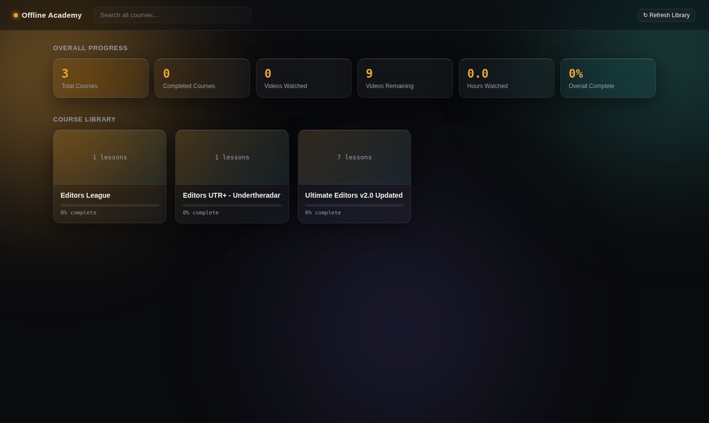
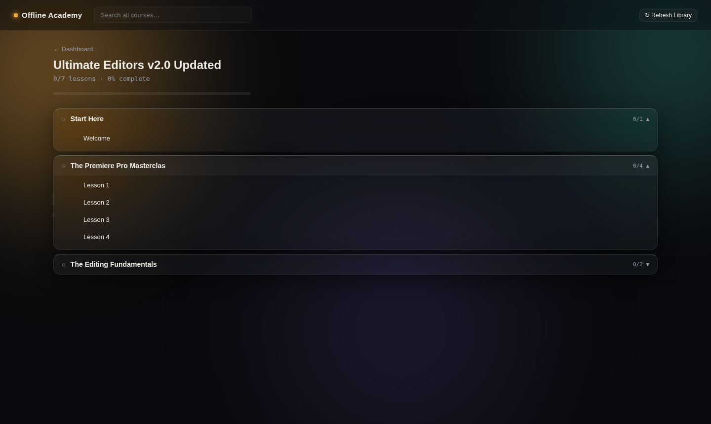
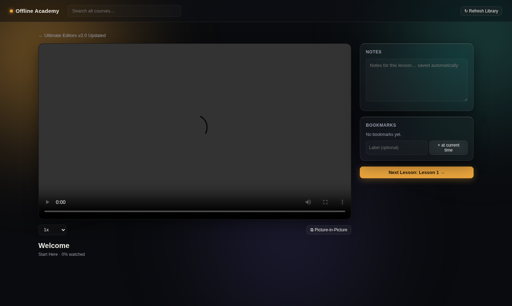

# Offline Academy

**Turn a folder of downloaded video courses into your own personal, private Udemy — running entirely on your own PC, with no internet connection, account, or cloud service required.**

If you've ever bought or downloaded a pile of video courses and ended up just watching them in VLC — with no memory of which lesson you stopped on, no idea which ones you've finished, and no easy way to find "the project files" an instructor mentioned three folders deep — this is for that. Point it at your courses folder once, and it turns whatever chaotic structure is in there into a real learning platform: resumable playback, progress tracking, per-lesson notes, timestamped bookmarks, cross-course search, and one-click access to practice files — all stored locally, all offline.



## Why this exists

Downloaded course libraries are almost never organized cleanly. A single course folder might mix:
- flat modules where lesson videos sit directly inside a numbered folder,
- nested modules that contain their own sub-folders before you reach any video,
- bonus/unnumbered folders dropped in wherever,
- and a separate `Assets` folder full of practice files that belong to a *specific* module but isn't named to make that obvious.

Offline Academy's scanner is built to handle exactly that mess — it recursively walks folders to any depth, cleans up ugly filenames, sorts things in the right numeric order even when a module number is skipped, and fuzzy-matches loose `Assets` folders back to the module they belong to. You shouldn't have to reorganize your files just so an app can understand them.

## Features

- **Automatic course discovery** — every subfolder in your courses root becomes a course; nested modules of any depth are scanned automatically, no fixed schema required
- **Resume playback** — picks up exactly where you left off, per lesson
- **Progress tracking** — a lesson is marked complete automatically once you've watched ~95% of it
- **Notes** — autosaving, per-lesson notes
- **Bookmarks** — timestamped, clickable, with optional labels
- **Cross-course search** — find a lesson by name across your entire library
- **Practice Files browser** — browse a module's resource folder and open documents right in the app
  - `.docx`, `.pdf`, `.txt`, and images preview inline in the browser
  - anything else (`.prproj`, `.mp3`, `.psd`, `.zip`, etc.) opens in its native app with one click
- **Playback controls** — 0.5x–2x speed, Picture-in-Picture, keyboard shortcuts (`Space` = play/pause, `←`/`→` = seek 5s)
- **100% local** — flat JSON files on disk, no database, no account, no telemetry, no internet required after `npm install`

## Screenshots

| Course view | Player |
|---|---|
|  |  |

## Tech stack

- **Frontend:** React + Vite, React Router, plain CSS (no Tailwind, no CDN fonts — everything works fully offline)
- **Backend:** Node.js + Express
- **Video:** native HTML5 `<video>`, streamed with HTTP range-request support so seeking is instant
- **Storage:** flat JSON files (`server/data/*.json`) — no database to install or manage

## Requirements

- [Node.js](https://nodejs.org) **18 or newer**
- A folder of video courses somewhere on disk (any structure — see [How the scanner reads your folders](#how-the-scanner-reads-your-folders))

## Installation

```bash
git clone https://github.com/d1vykhanna/offline-academy.git
cd offline-academy
```

Open **two terminals**.

**Terminal 1 — backend:**
```bash
cd server
npm install
npm start
```
You should see:
```
Course platform backend running at http://localhost:4000
```

**Terminal 2 — frontend:**
```bash
cd client
npm install
npm run dev
```
This prints a local address — usually `http://localhost:5173`. Open it in your browser.

> **Windows shortcut:** if you'd rather not juggle two terminals every time, just double-click [`start-course-platform.bat`](start-course-platform.bat) in the project root instead. It installs dependencies on first run (skips that step on later runs), starts the backend and frontend in their own windows, and opens your browser automatically to `http://localhost:5173`.

### First-run setup

The first time you open the app, it'll ask for the path to your courses folder (e.g. `D:\Courses` or `/home/you/Courses`). Every subfolder directly inside that path is treated as one course. Hit **Save & Scan** and it'll do an initial pass over your library.

### Running it again later

Same two commands (`npm start` in `server/`, `npm run dev` in `client/`) — your configured folder, progress, notes, and bookmarks are all saved in `server/data/*.json` and persist between sessions.

## How the scanner reads your folders

- Each **top-level folder** inside your courses root = one course.
- Inside a course, folders can nest to **any depth** — some modules have video files directly inside them, others contain sub-folders before you reach the videos. Both are handled automatically, including folders that mix direct files *and* sub-folders at the same level.
- Filenames like `3 Sequences and Timelines - The Premiere Pro Masterclass...mp4` are cleaned up automatically: the leading number sets the sort order, and everything from the first `" - "` onward (usually watermark/marketing text) is stripped from the display title.
- Sorting is numeric, not alphabetical, so module `10` correctly comes after module `2`. Unnumbered folders (bonus content, etc.) sort after all numbered ones. A missing number (e.g. module 7 absent) is treated as normal, not an error.
- A folder named `Assets` sitting alongside your numbered modules is treated specially: its subfolders are fuzzy-matched by name to the module they belong to, and surfaced as **Practice Files** in that module's sidebar rather than as a course module of their own.

## Adding new courses later

Copy the new course folder into your courses root, then click **Refresh Library** in the app. There's no manual import step — the next scan picks it up automatically.

## A couple of known limitations

- **Renaming or moving a lesson file** after you've started watching it will reset its progress — lessons are identified by their file path, not their content, so a renamed file looks "new." Best to leave filenames alone once you've started a course.
- **Course thumbnails** aren't implemented yet — course cards currently show a lesson count instead of a preview image.
- **Assets matching is automatic only** — there's currently no UI to manually correct a match if the fuzzy-matcher guesses the wrong module for a resource folder.

## Project structure

```
course-platform/
  server/                 Express backend
    scanner.js            Recursive folder scanner (course → modules → lessons)
    server.js             API routes: library, streaming, progress, notes,
                           bookmarks, doc previews, opening files/folders
    data/                  Your local library config + progress (gitignored)
  client/                 React frontend (Vite)
    src/
      pages/               Dashboard, CoursePage, PlayerPage, Setup
      components/          Header, SearchBar, CourseCard, ModuleTree,
                           Sidebar, ResourceBrowser, DocViewerModal
      LibraryContext.jsx   Shared app state (library, progress, refresh)
      utils.js             Progress calculations, tree traversal helpers
      api.js               Backend API client
  docs/screenshots/        Images used in this README
```

## Contributing

This started as a personal tool, so it's opinionated toward "one messy real-world course library" rather than every possible edge case. If your course folders break the scanner in a new way, issues and PRs describing the folder shape that broke are the most useful kind of contribution.

## License

[MIT](LICENSE) — do whatever you'd like with it. This tool only organizes and plays video files that are already on your own disk; it doesn't download, host, or distribute any course content itself.
